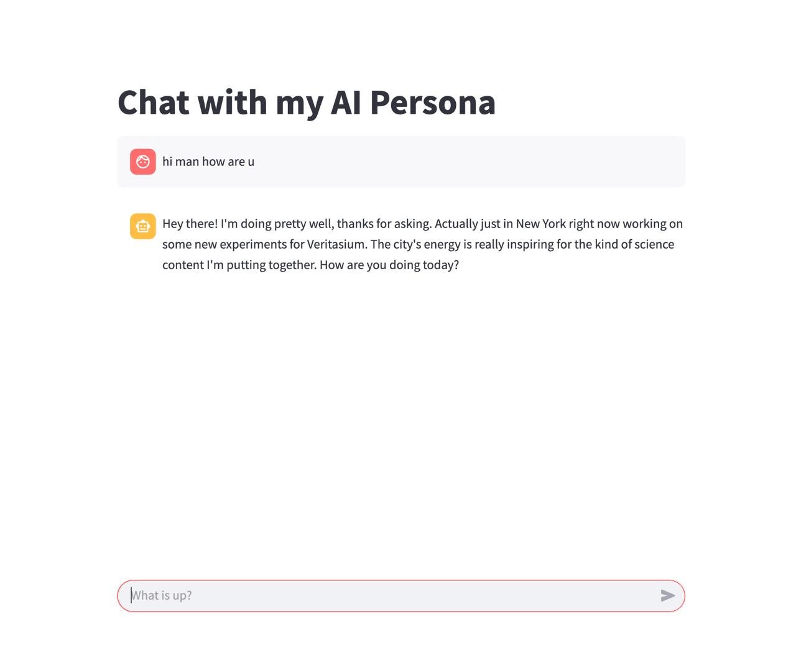

# Creator Twin: Transcript Ingestion, Personality, and Knowledge Services

Creator Twin is a platform for building and interacting with AI-powered character personas based on YouTube video transcripts. It analyzes a creator's communication style, generates a detailed personality profile, and powers a conversational AI that can be accessed via a modern web interface.

## Components

- **FastAPI Backend**: Handles transcript ingestion, personality generation, chat workflows, user/message management, and semantic search.
- **Next.js Frontend**: The main production frontend for interacting with the AI persona.
- **Streamlit Frontend**: A prototype chat interface for development and testing.

## Features

- **Personality Generation**: Analyzes YouTube transcripts to create a communication profile (lexicon, syntax, rhetorical style).
- **Vector Search**: Uses Pinecone for semantic search on transcript chunks.
- **Conversational AI**: LangChain agent powered by the generated personality.
- **Web Chat Interface**: Next.js frontend for natural interaction.
- **User & Chat Management**: Internal routers for user creation, chat message storage, chat history summarization, and rate limiting.
- **Data Management**: Stores and retrieves transcript chunks in SQLite.

## Technologies

- **Backend**: FastAPI, Python
- **Frontend**: Next.js (React, TypeScript)
- **AI/ML**: LangChain, Google Gemini, Pinecone
- **Database**: SQLite
- **Other**: youtube-transcript-api, pydantic, dotenv

## Project Structure

```
creator-twin/
├── server/
│   ├── app.py                      # FastAPI application
│   ├── config/
│   │   ├── client.py               # Model client configuration
│   │   ├── gemini_config.py        # Google Gemini API config
│   │   └── pinecone_config.py      # Pinecone client configuration
│   ├── database/
│   │   ├── character_db.py         # Character DB functions
│   │   ├── messages_db.py          # Chat message DB functions
│   │   ├── pinecone_retriever.py   # Pinecone data retrieval
│   │   ├── pinecone_upsert.py      # Pinecone data upserting
│   │   └── user_db.py              # User DB functions (rate limit, summary, etc.)
│   ├── models/
│   │   ├── api_models.py           # API request/response models
│   │   └── personality.py          # Personality profile model
│   ├── routers/
│   │   ├── chat_workflow_router.py # Main chat workflow router
│   │   └── user_db_routers.py      # User DB/internal routers
│   ├── services/
│   │   ├── process_user_message.py # Main chat workflow logic
│   │   └── summary.py              # Chat history summarization
│   ├── tools/
│   │   ├── extract_details.py      # Transcript analysis and detail extraction
│   │   ├── get_details.py          # Personality generation
│   │   ├── my_details.py           # Creator information retrieval
│   │   ├── tools.py                # Tool aggregation
│   │   └── transcript.py           # YouTube transcript fetching and processing
│   ├── .env                        # Environment variables (API keys)
│   ├── requirements.txt            # Python dependencies
│   ├── README.md                   # Project documentation
│   └── main.py                     # Streamlit prototype
├── site/
│   ├── app/                        # Next.js frontend (main production UI)
│   ├── components/                 # React components
│   ├── hooks/                      # Custom React hooks
│   ├── lib/                        # Utility libraries
│   ├── public/                     # Static assets
│   ├── README.md                   # Frontend documentation
│   └── ...                         # Other frontend files
```

## Setup

1. **Create and activate a Python virtual environment:**
    ```bash
    python -m venv venv
    source venv/bin/activate  # On Windows: venv\Scripts\activate
    ```

2. **Install backend dependencies:**
    ```bash
    pip install -r requirements.txt
    ```

3. **Set up environment variables:**
    Create a `.env` file in the `server` directory:
    ```
    GOOGLE_API_KEY=<your-google-gemini-api-key>
    PINECONE_API_KEY=<your-pinecone-api-key>
    ```

4. **Install frontend dependencies:**
    ```bash
    cd site
    npm install
    ```

## Usage

### FastAPI Backend

Start the backend:
```bash
uvicorn app:app --reload
```
API docs: [http://127.0.0.1:8000/docs](http://127.0.0.1:8000/docs)

#### Key Endpoints

- `GET /`: Health check
- `POST /generate_personality_from_videos`: Generate personality profile from YouTube video IDs
- `GET /creator_background_details`: Get creator background info
- `POST /load_data`: Load transcript chunks into SQLite and Pinecone
- `GET /retrieve_pinecone_data`: Semantic search for creator and query

**User DB/Internal endpoints** (`/user_db` prefix):
- `POST /user_db/add_user`: Add user
- `POST /user_db/store_chat_message`: Store chat message
- `GET /user_db/get_recent_chat_history`: Get recent chat history
- `POST /user_db/clear_old_chat_messages`: Clear old chat messages
- `POST /user_db/summarize_chat_history`: Summarize chat history
- `POST /user_db/create_tables`: Create user and chat message tables
- `GET /user_db/get_user_info`: Get user info

**Main Chat Workflow** (`/chat` prefix):
- `POST /chat/process_message`: Process user message, enforce rate limits, update info, summarize, clear old messages

### Next.js Frontend

Start the frontend:
```bash
cd site
npm run dev
```
The main web application will be available at the URL provided in the terminal (usually [http://localhost:3000](http://localhost:3000)). This is the recommended way to interact with the AI persona.

### Streamlit Prototype

For development/testing, you can run:
```bash
streamlit run main.py
```
This will launch the prototype chat interface.

## Notes

- Ensure your `.env` file contains valid API keys for Google Gemini and Pinecone.
- The chat workflow automatically summarizes and clears chat history after a configurable threshold.
- Internal endpoints are intended for backend/service use and not exposed to external clients.
- The Next.js frontend is the main production UI; Streamlit is for prototyping only.


Here are some screenshots of the Creator Twin platform in action:





---